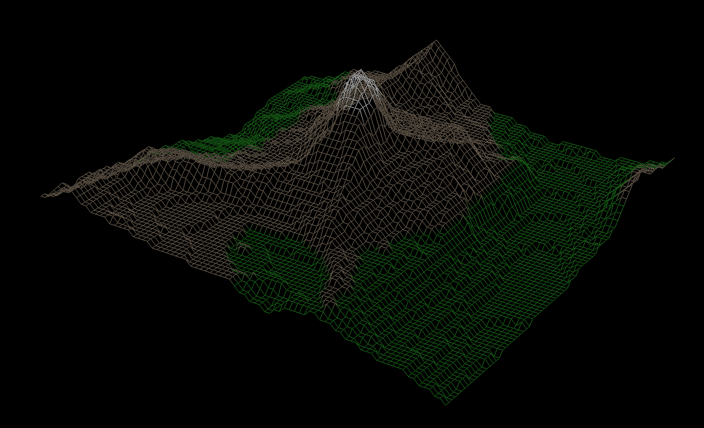
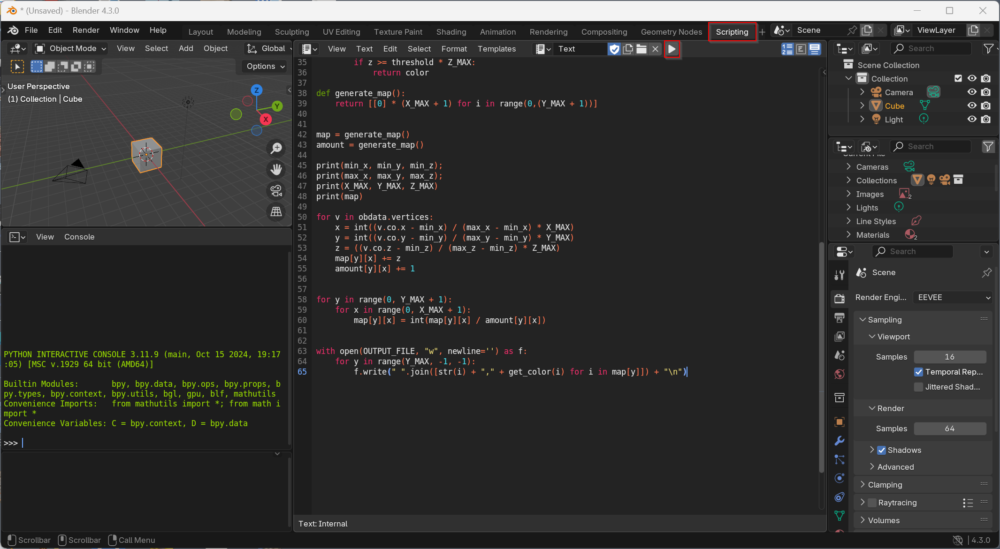

blender2fdf
===========

[blender2fdf](http://github.com/baschni/blender2fdf) is a python script to convert any 3d model opened in Blender to a file format called *fdf*, which is a type of 3d file used by the fdf project (fil de fer, engl. wireframe) of [42 programming schools](https://www.42network.org/).


**3d model of Matterhorn** openend in fdf program, original model by Ricardo Garnica

## Motivation

fdf is a great project in the common core, allowing you to enter the world of 3d rendering at the very basics. While there are some tests maps shipped with the subject, it is much cooler to have a personal map, showing your favorite 3d object (which for me, of course, is the Matterhorn).

## Usage



Open your 3D model in blender and go to the scripting area (`Scripting` in the menu). Click on `+ New` and paste the [script](blender2fdf.py). Click on `⯈` to run the [script](blender2fdf.py).

In Unix start blender from the console to see the output of the script. In windows a separate terminal will open automatically when you run a script.

The script has been developed and tested with Blender 4.3.0 (Windows version).

## Customization

Set `OUTPUT_FILE` to the file you want to export to. If it exists it will be overwritten.

Change `X_MAX` to set the number of values per line (the map width). `Y_MAX`, the number of lines in the fdf file, will be set automatically according to the proportions of your model.

You can change `Z_SCALE` to reduce or enlarge the Z proportions (e.g. 0.5 for half of the height of the blender model, 2 for the double).

You can set colors for height segments by changing the dict `colors`. All points above a certain height in the image will be colored according to the respective dictionary entry.
In the following example the program will color all points that lie over 80% of the highest Z value white, the points over 30% of the highest Z value brown and everything below green:

```
colors = {
    0: "0x228B22", 
    0.3: "0x92816d",
    0.8: "0xFFFFFF"
}
```

## Issues

If you get the error `permission denied` when writing to the output file, try to give an absolute, not a relative path.

If you get the error `division by 0` on the statement `map[y][x] = int(map[y][x] / amount[y][x])` the vertices in your model are not dense enough for the number of fields defined by `X_MAX` * `Y_MAX`. Try to reduce `X_MAX` or add some more python code to interpolate missing coordinates.

## See also

Although it seems not to work 100% anymore, have a look at  [42MapGenerator](https://github.com/jgigault/42MapGenerator). It shows some great screenshots of the Alps or of [California Central Valley](https://en.wikipedia.org/wiki/Central_Valley_(California)) rendered in fdf.